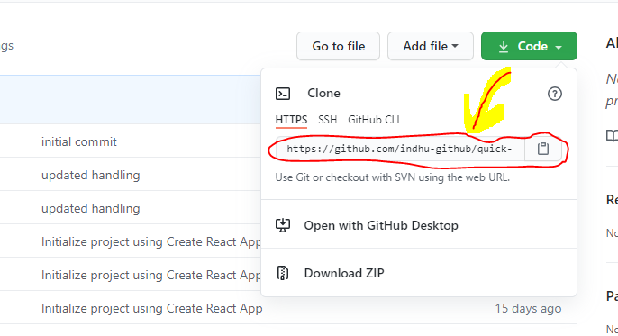
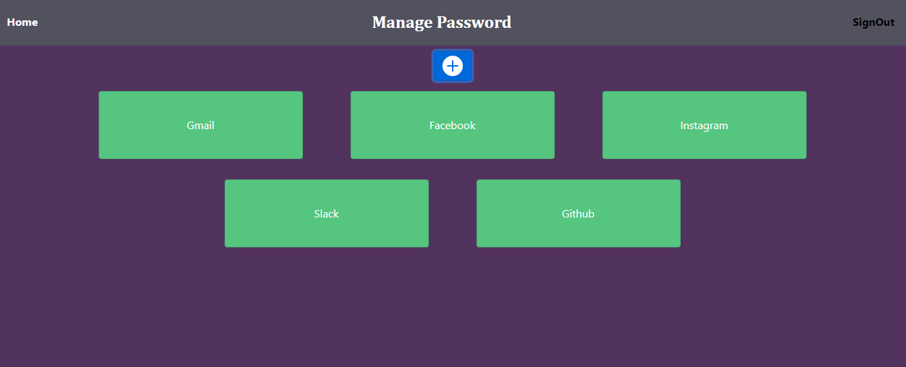

## This Project will manage Your all account username && Password 

- ### Initial setup   
    1) clone/copy this project in your pc by using command : 
      `git clone <projectLink>`
      
     2) Install all the dependencies of the project by command :  
    `npm start`
    3) You are ready to use the App

- ### Pages 

    **SignUp** : It will allow you to create account as new user.  
    **SignIn** : It will allow user to access the Home page after authentication. 
    **Home Page** : Here you can add as well as delete your account. 

- ### Home page functionality
   - One can add the account by clicking the  (+) button placed on the top.
   - One can delete the account by clicking on the clear icon placed at the top right corner of the account.
   - One can add as many email and password of any account  by clicking on the account.
   - One can also delete a specific email and password associated with the account.

 - ### Picture 
  
      
          
 - ### Link to direct use the APP
   [ProjectLink](https://managemypassword-5e257.web.app)

